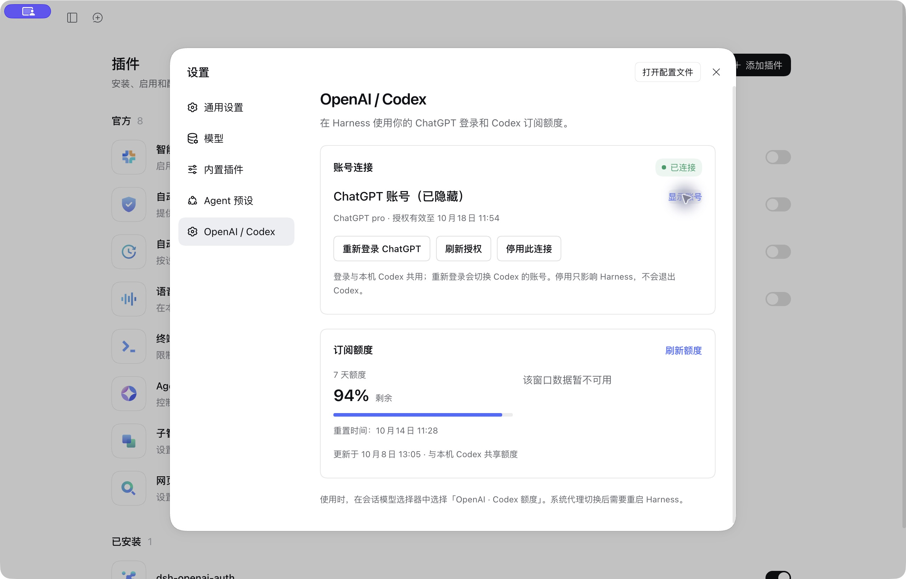
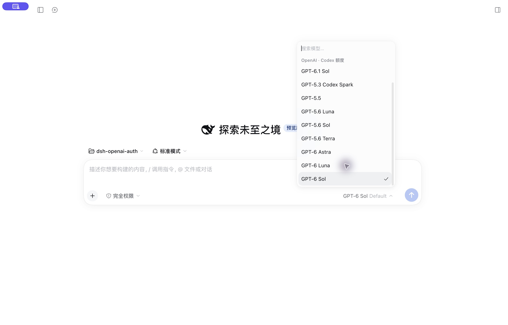
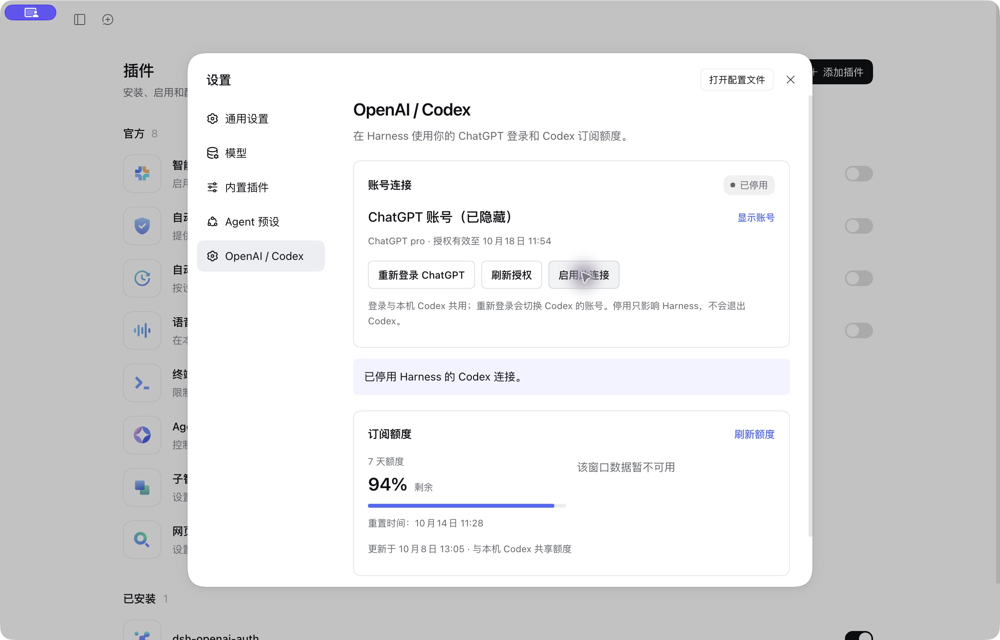

# OpenAI / Codex Auth for DeepSeek Harness Desktop

在 DeepSeek Harness 桌面版连接本机 Codex 的 ChatGPT 登录，使用同一账号的 Codex 订阅额度，并在原生设置页管理账号、授权和额度。

**原生 Harness bundle + 后端 provider + 客户端设置页** · MIT · 无安装脚本 · 无需 OpenAI Platform API key

这是独立社区插件，与 DeepSeek 或 OpenAI 的官方插件无关联。插件不增加额度，也不改变 OpenAI 的账号权限或限速规则。

## 截图展示

以下为 Harness 桌面端实际界面，账号邮箱已隐藏，背景工作区已收起。

### 账号与订阅额度



### 原生模型选择器



### 停用连接



## 功能

| 功能 | 使用方式 |
| --- | --- |
| 复用已有登录 | 识别当前用户本机 Codex 的 ChatGPT 登录缓存 |
| 浏览器登录 | 点击登录，进入官方 Codex 启动的 ChatGPT 浏览器授权流程 |
| 自动续期 | token 即将过期时，由官方 Codex CLI 负责更新缓存 |
| 手动刷新 | 页面中的「刷新授权」立即请求官方续期 |
| 查看额度 | 显示官方返回的各额度窗口、剩余比例和重置时间 |
| 管理连接 | 启用或停用 Harness 中的 Codex 连接，并保存选择 |
| 隐藏账号 | 录屏、演示或截图前隐藏邮箱 |
| GPT-6.1 Sol | 补齐旧版 Harness 目录缺少的模型入口；支持 low / medium / high / xhigh / max |
| 原生对话能力 | 复用 Harness adapter 的流式输出、工具调用、历史 replay 和图片处理 |
| 系统代理 | macOS 上按当前系统 HTTP/HTTPS 代理运行，不修改系统设置 |

## 兼容性与前提

- 已验证：**macOS + DeepSeek Harness Desktop `0.2.0-rc.2` + Codex CLI `0.154.0`**。
- 插件当前绑定 Harness `0.2.0-rc.2` 的接口版本；其他 Harness 版本尚未验证。
- 需要本机安装官方 Codex CLI，并有可用的 ChatGPT / Codex 账号。
- 当前支持 **file 存储**的 Codex ChatGPT 登录，即 `CODEX_HOME/auth.json` 或默认的 `~/.codex/auth.json`。
- Keychain-only 存储、Windows 和 Linux 桌面环境尚未验证；macOS PAC / SOCKS-only 系统代理暂不支持。
- 额度和模型权限由 OpenAI 管理，模型出现在选择器中不代表该账号一定有调用权限。

## 安装到桌面版

1. 安装官方 Codex CLI。在终端运行 `codex login status`，确认使用 ChatGPT 登录；没有登录时可先运行 `codex login`，也可安装后从插件界面登录。
2. 在 Harness 左侧打开「插件」→「添加插件」。
3. 输入以下 GitHub 包地址，或从 [Releases](https://github.com/solstice621/dsh-openai-auth/releases) 下载 `.tgz` 后填写其绝对路径：

   ```text
   github:solstice621/dsh-openai-auth#v0.2.4
   ```

4. 安装并启用插件，然后完全退出并重新打开 Harness。
5. 打开左下角「更多」→「设置」→ **OpenAI / Codex**，确认账号已连接。
6. 在会话模型选择器中选择 **OpenAI · Codex 额度** 下的模型，例如 **GPT-6.1 Sol**。

本仓库提供可直接运行的 JavaScript 和原生 client entry，不需要执行 `prepare`、`postinstall` 或第三方安装脚本，也不需要修改 App 安装包或 asar。

若桌面启动时显示 DeepSeek 欢迎页，可选择「添加 API Key」→「稍后配置」进入，再使用 Codex 模型。

## 授权界面操作

### 使用已有账号

页面显示邮箱、ChatGPT 订阅类型、当前连接状态和授权有效期。已在 Codex 登录的账号会自动识别，无需复制 token。

### 登录与切换账号

点击「登录 ChatGPT」或「重新登录 ChatGPT」，浏览器会打开官方登录页面。插件页显示等待状态，提供再次打开页面和取消本次登录的按钮；完成后自动更新。等待十分钟后会取消本次尝试。

**登录与本机 Codex 共用。重新登录会切换本机 Codex 的账号。** 取消本次登录不会主动执行全局退出。

### 刷新授权

点击「刷新授权」，插件通过官方 `codex app-server` 请求续期，再重新读取缓存。成功后页面更新有效期。实际推理请求也会在 token 距离过期不足五分钟时自动续期。

### 查看额度

打开页面后读取额度，也可点击「刷新额度」。页面优先使用官方返回的多额度桶数据，显示每个可用窗口的剩余百分比和重置时间。缺失窗口显示不可用，网络失败会显示错误，未知数据不会被当成零。

额度快照与本机 Codex 共享账号；页面上的时间是最近一次读取时间，并非持续实时更新。

### 停用与启用

「停用此连接」只阻止该 Harness provider 发起新的推理请求，并保存选择；不会退出 Codex、删除缓存或取消已有请求。点击「启用此连接」恢复使用。

## 配置

桌面进程的 PATH 可能找不到 Codex。用 `command -v codex` 查询可执行文件，然后在桌面 profile 的 `cordis.patch.yml` 配置插件：

```yaml
- id: dsh-openai-auth
  name: dsh-openai-auth
  config:
    codexCommand: /absolute/path/to/codex
    # 可选；默认 CODEX_HOME 或 ~/.codex
    # codexHome: /absolute/path/to/.codex
    # useSystemProxy: true
    # refreshSkewSeconds: 300
```

| 字段 | 默认值 | 说明 |
| --- | --- | --- |
| `enabled` | `true` | 可在界面实时修改并保存 |
| `codexCommand` | `codex` | 官方 Codex CLI 的命令或绝对路径 |
| `codexHome` | `CODEX_HOME` 或 `~/.codex` | 登录缓存所在目录 |
| `refreshSkewSeconds` | `300` | 提前续期窗口，范围 0–3600 秒 |
| `useSystemProxy` | macOS 为 `true` | 没有 Harness 显式代理时，沿用当前系统静态 HTTP/HTTPS 代理 |

除连接开关外，修改配置后请重启 Harness。

## 凭据、权限与网络

- 插件读取当前用户指定目录中的 Codex 登录缓存，校验 ChatGPT 登录类型、账号一致性和 token 有效期。
- 插件不把 access/id/refresh token 写入 Harness 设置或浏览器存储；UI 只接收允许展示的账号字段、状态与额度。
- 登录和续期由官方 Codex CLI 负责写入 Codex 缓存；插件不自行实现 refresh token 轮换。
- 后端会启动所配置的 Codex 可执行文件，使用 app-server 的账号 RPC。请只配置自己信任的官方 CLI 路径。
- 对话内容按正常模型调用发送给 OpenAI。账号、登录和额度请求通过官方 Codex；插件没有自己的统计或中转服务。
- 页面操作经过 Harness 原生 `/api` 认证边界，卸载插件时撤销其路由和后台资源。
- macOS 读取当前系统代理时会调用系统自带的 `scutil`。如果 Harness 已有显式代理，优先沿用该配置。
- 使用系统代理时，代理设置变化会阻止后续请求并提示重启，不会自动修改操作系统代理或启动 VPN。

`apiKey` 是底层 pi-ai 的通用 bearer-token 传递接口；本插件传入的是 Codex OAuth access token，不接受 OpenAI Platform API key，也不会回退到 API 按量计费。

## 常见问题

**显示未登录或无法读取缓存**：确认 Codex 使用 ChatGPT 登录。Keychain-only 用户若希望使用本插件，可自行运行 `codex -c cli_auth_credentials_store='file' login`；插件不会自动修改凭据存储偏好。

**无法启动 Codex**：配置 `codexCommand` 为真实绝对路径，再重启 Harness。

**网络超时或代理已切换**：检查当前网络与代理是否可达，重启 Harness，再刷新授权。不要把仅在特定网络可用的代理永久启用。

**模型调用被拒绝**：检查账号权限、额度和限速，尝试该账号可用的模型。目录以 Harness 捆绑版本为主；0.2.4 为旧目录补充 GPT-6.1 Sol，上游已有该模型时优先采用上游元数据。模型目录并非账号权限证明。

**为什么已有会话没自动换模型**：插件不会重写旧会话；请在会话模型选择器中切换。

**如何卸载**：先选择其他 provider，再在 Harness「插件」页停用或卸载本插件。Codex 自己的登录保持由 Codex 管理。

## 验证与开发

```sh
npm test
npm pack --ignore-scripts
```

22 项本地测试覆盖模型目录补齐、上游元数据优先、推理等级、缓存读取、续期并发、取消、错误脱敏、账号一致性、额度归一化、登录通知、连接状态及代理变更。原生 runtime 另外验证了路由撤销、官方登录启动与取消、真实续期、额度查询、工具调用和桌面推理。浏览器重新登录最后一步需要账号持有人完成；本项目未用自动化替用户更换账号。

已验证模型包括 GPT-6.1 Sol 的原生流式请求、工具调用与历史回放，GPT-6 Sol 的桌面请求，以及 GPT-5.6 Sol 的工具调用与历史回放。GPT-6.1 Sol 暂沿用当前 Harness 原生 Codex 路由的 272,000 token 上下文预算；API 文档中的更大上下文未在此订阅路由验证。其他列出模型的可用性仍以各账号实际调用为准。

## English overview

A native bundle and settings plugin for DeepSeek Harness Desktop. It reuses the local official Codex ChatGPT login and subscription usage, adds browser sign-in, managed token refresh, quota windows, and a persistent connection toggle. Credentials stay managed by Codex; display-safe data only reaches the UI. The current tested target is macOS, Harness Desktop `0.2.0-rc.2`, and Codex CLI `0.154.0`. File-based login storage is required. This independent community plugin is not an official OpenAI or DeepSeek product.

## 依据与许可

- [GPT-6.1 Sol 官方模型信息](https://developers.openai.com/api/docs/models/gpt-6.1-sol)
- [OpenAI Codex 认证](https://learn.chatgpt.com/docs/auth)
- [OpenAI Codex app-server](https://learn.chatgpt.com/docs/app-server)
- [Harness 插件打包与分发](https://github.com/deepseek-ai/deepseek-harness/blob/master/docs/user/develop/basic/publish.md)
- [Harness 原生插件显示元数据](https://github.com/deepseek-ai/deepseek-harness/blob/master/docs/cookbook/adding-a-package.md#plugin-display-metadata)

[MIT License](LICENSE)
